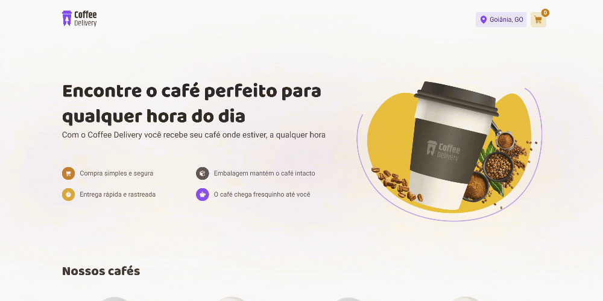
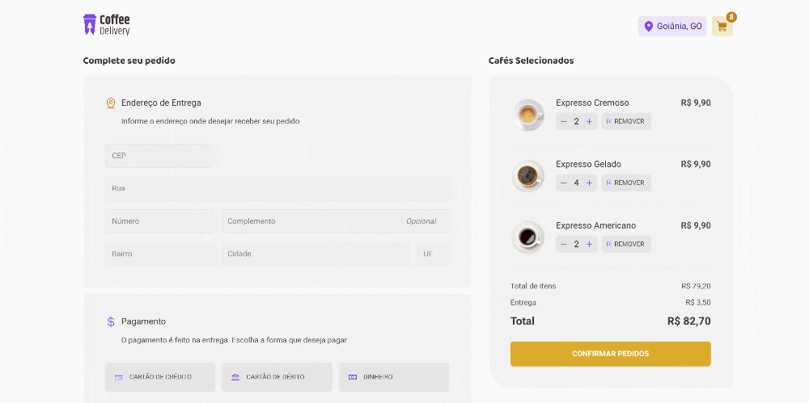

# Coffee Delivery - Ignite Bootcamp Challenge
Challenge proposed by Ignite Bootcamp (Rocketseat) to practice React development.

## About it

In this challenge I'm developing an application to manage a coffee's shop cart, that has the following functionalities:
- List of products (coffees) available for purchase
- Add a specific amount of items to the cart
- Increase or remove the amount of items in the cart
- Form for the user to fill in his address
- Display the total items in the cart in the Header
- Display the total value of the sum of items in the cart multiplied by the value

Despite being few features, I'm gonna need to remember concepts such as:
- States
- ContextAPI
- LocalStorage
- Immutability of state
- Lists and keys in ReactJS
- Properties
- Componentization

## Layout

